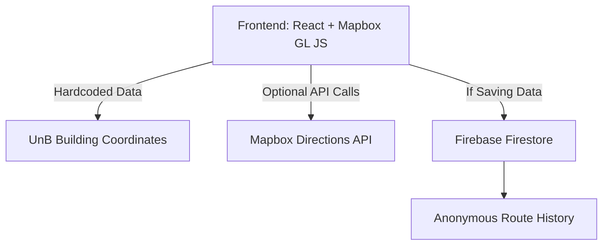

# UnB Campus Navigation App - Architecture

## 1. System Architecture Diagram

unb-campus-waze/

├── public/

│   └── index.html

├── src/

│   ├── components/

│   │   ├── Map.js          # Main Mapbox GL component

│   │   └── Controls.js     # Start/end selection UI

│   ├── data/

│   │   └── buildings.js    # Hardcoded UnB coordinates

│   ├── App.js

│   └── index.js

├── package.json

└── README.md
