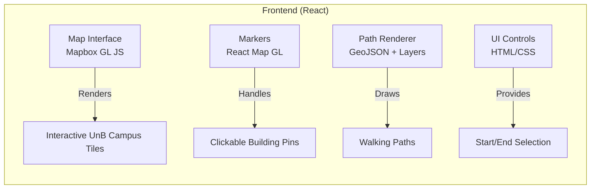

## 1.📋 Introdução ao Contexto do Projeto

**🎯 Objetivo**: Criar uma plataforma digital colaborativa onde:
- Estudantes possam se localizar
- Alunos novos possam conhacer o campus com facilidade

**Desafios Técnicos Envolvidos**:
- Processar dados geográficos com precisão
- Garantir que a interface seja usável por estudantes da Universidade 

## 2. Fundamentos sobre Requisitos de Software

### O que é o Levantamento de Requisitos?
- Condição necessária para a obtenção de certo objetivo ou para preenchimento de certo fim.
- É o ato de definir as funções e restrições que o produto a ser desenvolvido deve possuir.

**Requisitos Funcionais**: 
- Diretamente ligado com as funcionalidades do software, como o sistema deve reagir a entradas espeíficas, aquilo que o cliente "pede".

**Requisitos Não Funcionais**:
-Não dizem respeito diretamente as funcionalidades do software, mas deve estar incluso naquele produto, como segurança, confiabilidade e velocidade de resposta.

## A. Frontend (Pure React) Components

### Cenários de Uso Demonstrativos

#### Evento Comunitário Massivo
- **500+ usuários simultâneos**:
  - Microsserviço de mapas escala horizontalmente
  - Funções serverless para autenticação
  - Balanceamento de carga automático

#### Uso Diário
- **Performance**:
  - Consultas geoespaciais em <500ms
  - Cache de resultados frequentes
- **Acessibilidade**:
  - Interface responsiva
  - Suporte a tecnologias assistivas

### Vantagens Estratégicas
| Benefício         | Descrição                                  |
|-------------------|--------------------------------------------|
| **Custo**         | Free tiers suficientes para MVP            |
| **Escalabilidade**| Arquitetura modular para crescimento       |
| **Manutenção**    | Componentes independentes                  |

### Recursos Educativos
- [Documentação Oficial PostGIS](https://postgis.net/docs/)
- [Guia de Acessibilidade Mapbox](https://docs.mapbox.com/help/tutorials/accessible-maps/)
- [OWASP Authentication Cheat Sheet](https://cheatsheetseries.owasp.org/cheatsheets/Authentication_Cheat_Sheet.html)
